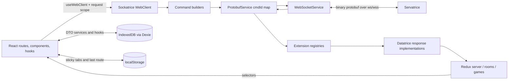

# Webatrice current-state assessment

Point-in-time audit: **2026-08-24 (Australia/Sydney)**

Companion documents: [Cockatrice parity matrix](cockatrice-parity-matrix.md) · [Agent onboarding](agent-onboarding.md) · [Audit limitations](audit-limitations.md)

## Repository baselines

| Repository | Resolved root | Remote and default branch | Pre-audit state | Audited baseline |
|---|---|---|---|---|
| Webatrice | `C:/Users/keech/Documents/Webatrice/Webatrice` | `https://github.com/Cockatrice/Webatrice`; remote `HEAD` reported `master` by `git ls-remote --symref` | `feature/ui-revamp-sonic` at `29e9017d77e290b7f1753fccb4381bc11003e1b4`, tracking its origin branch, with one modified `packages/webatrice/src/i18n-default.json` | `master` at `cfdf276368f6663db71a952665fafb0adee307ec`, fast-forwarded to `origin/master`, clean before documentation changes |
| Cockatrice and Servatrice | `C:/Users/keech/Documents/Webatrice/Cockatrice-audit` | `https://github.com/Cockatrice/Cockatrice.git`; remote `HEAD` reported `master` by `git ls-remote --symref` | Not available as a full local checkout; Webatrice held only the sparse protocol submodule at `vendor/cockatrice` | Fresh shallow `master` checkout at `a571a9aa04796915db172e2e60280ecbd5ec8926`, clean and already equal to `origin/master` |

The initial generated-catalog modification was discarded under the audit brief's disposable-sandbox authorization before switching Webatrice to its remote default branch. The separate Cockatrice checkout contains both the desktop client (`cockatrice/`) and server (`servatrice/`). No Servatrice-only repository was needed.

## Executive summary

Webatrice is a substantial React/TypeScript implementation, not a thin prototype. Its three-workspace architecture cleanly separates browser UI (`@cockatrice/webatrice`), normalized Redux state and inbound response handling (`@cockatrice/datatrice`), and protobuf/WebSocket commands, events, correlation, reconnect and keepalive (`@cockatrice/sockatrice`). Static inspection, 3,106 passing unit/integration tests, and eight passing Docker-backed real-Servatrice e2e tests establish broad coverage of login, rooms, chat, deck and live-game paths. A production bundle builds and the development server responds successfully.

Functional parity is nevertheless incomplete. The [parity matrix](cockatrice-parity-matrix.md) contains 94 stable planning items: 29 Complete, 35 Partial, 22 Missing, 6 Divergent, and 2 Unverified. The most urgent gaps are reliable recovery after a dropped authenticated session, the divergent force-start implementation, invisible server/room/private-chat failure feedback, inert account-maintenance controls, and the absent replay browser/player. In several areas the transport and Redux layers already contain protocol support that has no complete route-level UI, which should reduce implementation risk for the next increments.

The current UI revamp also carries integration debt. Root lint reports 3,555 Webatrice errors, including layer-boundary violations, while Sockatrice and Datatrice pass. The checked-in CI workflow does not run the Webatrice lint task. Large route components—especially `features/game/components/PlayerBox/PlayerBox.tsx` and the new deck/game surfaces—make parity review and regression isolation harder. These issues do not erase the observed build/test successes, but they weaken maintainability and confidence in untested paths.

Browser delivery is proven for the configured desktop Chromium target: the production bundle booted without page/console errors and six Playwright scenarios passed against Dockerized Servatrice/MySQL. These scenarios covered browser WebSocket login, IndexedDB host persistence and re-login, a 60-second keepalive soak, game creation/join/deck submission/core play, spectator gating, and bulk battlefield actions. No Firefox or Safari project is configured and no explicit supported-browser matrix exists, so current Firefox/Safari operation remains unverified rather than assumed.

## Verified build and test status

Validation used Node `24.19.0` and npm `11.17.0`; the repository declares `npm@10.9.4` and CI uses Node 24. Validation-generated lockfile and i18n changes were restored after the run.

| Command | Result | Evidence and qualification |
|---|---|---|
| `npm install` | Pass | Completed in 19 seconds, including sparse submodule setup, `buf generate`, Webatrice prebuild and Husky. npm warned about four unapproved dependency install scripts. |
| `npm run typecheck` | Pass | All five Turbo tasks succeeded. The first sandboxed attempt was blocked by esbuild filesystem access; the source-level result passed outside that restriction. |
| `npm run lint` | **Fail** | Sockatrice and Datatrice passed; Webatrice reported **3,555 errors and 12 warnings**. Frequent categories were `curly`, `max-len`, indentation, unused symbols, missing `react-hooks/exhaustive-deps`, and `boundaries/dependencies`. |
| `npm test` | Pass | Sockatrice 573, Datatrice 1,023, Webatrice 1,129: **2,725 passed, 2 skipped**. Webatrice emitted React `act(...)`, selector memoization and PostCSS module-type warnings. |
| `npm run test:integration` | Pass | Sockatrice 146, Datatrice 107, Webatrice 128: **381 passed, 2 skipped**. The suite uses real protobuf/Redux paths but mocked WebSockets and no real Servatrice. |
| `npm run build` | Pass with warnings | Production Vite build succeeded after process-local Git/sandbox configuration. Vite warned that `index` (790.12 kB) and generic vendor (640.43 kB) chunks exceed 500 kB; PostCSS config was reparsed as ESM. |
| `npm run dev -- --host 127.0.0.1 --port 5173 --open=false --strictPort` from `packages/webatrice` | Pass | Vite ready in 1.2 seconds; `GET /` returned HTTP 200, `text/html`, title `Webatrice`. No authenticated flow was exercised. |
| `npm run test:e2e` | Pass | Docker Desktop 4.87.0 / Linux Engine 29.7.2 ran the pinned Servatrice 3.0.0 and MySQL 8 stack. Sockatrice passed **2/2** real-server tests; Webatrice passed **6/6** desktop-Chromium Playwright tests. Both Compose projects removed their containers, networks and volumes. |

The root `golden` command was not repeated: its lint, unit and integration constituents were run directly, and the known Webatrice lint failure guarantees a non-zero result. Coverage variants were not run, so this audit reports test inventory and results, not a line-coverage percentage.

## Repository map and toolchain

| Path | Responsibility and evidence |
|---|---|
| `package.json`, `package-lock.json`, `turbo.json` | npm workspaces and Turbo task graph. Root scripts orchestrate build, lint, typecheck, unit, integration and e2e work. |
| `packages/sockatrice/` | ESM protocol/transport library. `src/WebClient.ts`, `src/services/ProtobufService.ts` and `src/services/WebSocketService.ts` are the principal seams. Generated bindings live under `src/generated/`. |
| `packages/datatrice/` | Redux Toolkit state library. `src/store/rootReducer.ts` owns `server`, `rooms`, and `games`; `src/api/attachResponseHandlers.ts` wires Sockatrice callbacks to response implementations and reducers/listeners. |
| `packages/webatrice/` | React 19 SPA, Vite 8 build, MUI 9/Emotion plus Tailwind/CSS tokens, React Router, Dexie, i18next, and feature routes. |
| `packages/webatrice/src/features/` | Route-level vertical slices: account, decks, game, login, logs, player, rooms, server, settings, shell and shortcuts. |
| `packages/webatrice/src/components/`, `dialogs/`, `feature-widgets/`, `feature-wrappers/` | Shared UI primitives/dialogs, cross-feature capabilities, and page chrome. Layer rules are declared in each package's `eslint.boundaries.mjs`. |
| `packages/webatrice/src/services/dexie/` | IndexedDB database, versions and DTOs for persistent browser data. |
| `packages/*/integration/` and co-located `*.spec.*` | Mock-boundary integration suites and unit/component tests. |
| `packages/webatrice/e2e/`, `docker/servatrice/` | Chromium Playwright flows against a Dockerized pinned Servatrice image (`2026-05-08-Release-3.0.0`). |
| `vendor/cockatrice/` | Shallow/sparse submodule pinned at `63143f941643dc2f46f658cb51ea3b5727da3e56`; supplies protobuf definitions, not a full parity-reference checkout. |
| `.github/instructions/` | Current architecture, transport, state and test invariants. The README's old `root.instructions.md` reference was stale at the audited commit. |
| `architecture/` | Mermaid sources and checked-in PNGs for high-level and command/event flows. |

The source packages require Node `>=20` where an engine is declared; the active CI matrix is Node 24. The manifest pins npm `10.9.4`. Build libraries use `tsup` and TypeScript 6; the app uses Vite/Rolldown. Protobuf-ES bindings are generated from Cockatrice's `.proto` definitions with Buf.

## Architecture and major modules

`packages/webatrice/src/index.tsx` installs the BigInt serialization polyfill before store creation, mounts `DatatriceProvider` with Webatrice's `action` and `shortcuts` extension reducers, creates the singleton Sockatrice client through `WebClientProvider`, then renders `AppShell`. A card-preview popup is a deliberate carve-out: the same bundle detects `#/card-preview-popup`, omits the router/providers, and receives card state through `BroadcastChannel`.

`AppShell.tsx` uses `MemoryRouter`, not a URL-backed browser router. `components/layout/TopBar.tsx` mirrors the last route and sticky tabs to `localStorage`, and `AppShell` rehydrates the route on reload. This produces desktop-like internal tabs, but browser back/forward, bookmarking, and deep-link expectations differ from a typical web SPA. It is an intentional UI architecture difference; capability impact is itemized where material in the parity matrix.

`AppShellRoutes.tsx` registers account, deck list/editor, live game, moderator logs, player/private chat, login, room, server, settings, shortcuts, initialization and unsupported-browser routes. `types/routes.ts` also declares administration and replay paths that have no registered route at the baseline; enum presence alone is not treated as implementation evidence.

## Important runtime and data flows

### Startup and login

1. `index.tsx` loads polyfills, i18n and providers.
2. `DatatriceProvider` creates the combined `games`, `rooms`, `server`, `action` and `shortcuts` store.
3. `WebClientProvider` calls `attachResponseHandlers(store)` and constructs the Sockatrice singleton.
4. The catch-all route displays `Initialize` until `SessionResponseImpl.initialized` sets the store flag, then navigates to login.
5. Known hosts and settings load through Dexie-backed hooks. Login/test-connection actions use the selected host; successful session responses populate server/room/user state.

This flow is statically established and covered by unit/integration tests such as `features/login/useAutoLogin.spec.tsx`, `integration/src/app/login-autoconnect.spec.tsx`, and Sockatrice authentication suites. Real-Servatrice e2e additionally registered users, reached the room list, persisted a known host in IndexedDB across reload, and logged in again. Auto-login itself, activation, and password-reset completion were not exercised end to end.

### Command, response and event flow

UI code obtains `WebClient` through `useWebClient()` and calls `client.request.authentication|session|rooms|game|admin|moderator`. `ProtobufService.sendCommand` assigns a monotonically increasing `cmdId`, stores a callback, serializes a `CommandContainer`, and sends only when the socket is open. Responses resolve and delete the matching pending callback. Unsolicited room/session/game events are identified through generated protobuf extensions and dispatched to registered handlers; Datatrice response implementations and listener middleware normalize them into Redux.

There is no command timeout or retry in `ProtobufService`; `resetCommands()` clears pending callbacks on `DISCONNECTED`. Callers with user-visible operations must surface their own failure state. This is a statically established reliability constraint, not an observed dropped command.

### Connection loss and keepalive

`WebSocketService` uses a worker-backed keepalive loop with a main-thread interval fallback. `WebClient` opts into five exponential reconnect attempts (1-second base, 30-second cap). Failed initial connections do not retry; intentional closes, replacement sockets and `onerror` paths are gated to avoid duplicate state transitions. Non-open sends are logged and dropped. Unit tests cover these transport states.

Real-Servatrice e2e held both the Node WebClient and the Chromium UI continuously authenticated for 60 seconds across repeated ping/pong cycles, with no reconnect state observed. The suite did not force a transport drop, so session reauthentication, room rejoin and in-progress game resynchronization after reconnection remain unverified; this does not close `PLAT-006`.

## State management and persistence

Datatrice's `rootReducer.ts` owns normalized `server`, `rooms` and `games` state. Response implementations translate inbound protocol callbacks; listener middleware performs cross-action normalization and game logging. Webatrice adds an `action` snapshot reducer for `useReduxEffect` and a `shortcuts` reducer for hydrated keybinding overrides.

Redux is session memory. Persistent data is deliberately separate:

- Dexie database `Webatrice` stores settings, cards, sets, tokens, known hosts, formats, import metadata and a Scryfall read-through cache. Schema versions 1-4 live in `services/dexie/DexieSchemas/`.
- `localStorage` stores desktop-style sticky tabs, their owning server/user identity, last route, and selected gameplay layout preferences.
- Deck-editor code at the baseline also has browser-side persistence paths; exact parity with Cockatrice local files/server storage is classified in the matrix.

The v2/v3 Dexie migration drops and recreates card/set tables because IndexedDB primary keys cannot be changed in place. A card-data re-import can therefore be required after schema migration.

## UI architecture and design system

The application combines MUI/Emotion components with Tailwind utilities, static CSS, and tokens under `src/styles/`. `StyledEngineProvider injectFirst` gives the repo's CSS precedence over MUI runtime styles. `Layout.tsx` supplies the new top bar and fixed desktop work area; route features compose shared components and dialogs.

The redesign already improves several desktop workflows: persistent internal tabs, virtualized/structured lists, a separate live card-preview window, searchable/remappable shortcuts, resizable gameplay sidebar, and dense context-sensitive controls. These are not parity gaps where the complete underlying action remains available.

The next UI/UX work should follow three rules:

1. Finish protocol-backed capability before visual polish of the same workflow.
2. Make unavailable actions discoverable but correctly disabled with reasons, especially observer/judge/host permissions.
3. Consolidate duplicated custom dialog/context-menu/focus behavior into accessible primitives without hiding Cockatrice's complete action set.

Keyboard roles and ARIA attributes are present in many new gameplay controls, but there is no automated accessibility audit, assistive-technology test, or documented WCAG target. Accessibility is therefore mixed static evidence, not verified conformance.

## Test strategy and coverage

- Unit suites use Vitest/jsdom. WebSocket and IndexedDB boundaries are mocked in Webatrice setup; UI components, reducers, command builders and transport edge cases are exercised independently.
- Integration suites use real generated protobuf bytes, command/event registries, Datatrice reducers/listeners and (for persistence) fake IndexedDB. The WebSocket constructor is mocked and Servatrice is absent.
- E2E uses Playwright desktop Chromium against a production preview and Dockerized Servatrice/MySQL. All six Webatrice Playwright specs and both Sockatrice real-server specs passed in the audit. The suite covers core flows rather than the full parity matrix, and it has no Firefox or Safari project.
- Cockatrice itself was source-inspected only; its C++/Qt build and test suite were not run.

The current CI has a notable gap: `.github/workflows/ci.yml` runs Sockatrice and Datatrice lint conditionally but has no Webatrice lint step. That explains how the root lint baseline can contain thousands of app errors while the rest of CI remains structured as a gate.

## Technical constraints and apparent debt

- The root lint gate is red, and app lint is absent from CI.
- `PlayerBox.tsx` is roughly eleven thousand lines; `DeckEditor.tsx`, `Decks.tsx`, `GameBoardCell.tsx` and `TopBar.tsx` are also large orchestration/UI files. This raises change-collision and regression risk.
- `MemoryRouter` plus local route persistence trades normal URL/deep-link behavior for desktop-like tabs.
- Command callbacks have no timeout/retry; transport sends drop silently when not open.
- Browser support is implicit. Only IndexedDB is feature-detected and only Chromium is configured in Playwright.
- The built entry and vendor chunks exceed Vite's warning threshold; route-level code splitting is limited.
- `postcss.config.js` has ESM syntax without a package-level module declaration, causing repeated Node warnings.
- Unit tests pass with multiple React `act(...)` and selector-stability warnings, masking test-harness quality problems.
- The runtime client version string in `clientConfig.ts` remains `webclient-1.0 (2019-10-31)` despite package version 5.2.0; protocol compatibility impact was not established.
- Several Redux/protocol surfaces (replays, backend decks, moderation/admin) are more complete than their route UI, creating dead or partially surfaced capability.

## Evidence confidence

- **Directly observed:** dependency install, typecheck, lint failure, unit/integration results, production build, development-server startup and HTTP response, Dockerized Servatrice/MySQL startup, two Sockatrice real-server tests, six Chromium Playwright tests, and e2e resource cleanup.
- **Established by tests:** behaviors explicitly covered by the cited unit/integration suites; these do not imply a real browser/server round trip.
- **Established by static inspection:** architecture, route registration, command/event/state flow, persistence schema, visible handlers and Cockatrice comparisons in the parity matrix.
- **Inference:** user impact, implementation sequencing and cases where several source facts imply a likely runtime consequence. Matrix notes label material inference.
- **Unverified:** forced-drop recovery and game/room restoration, Firefox/Safari, background-tab throttling, external services, full replay workflows and any item explicitly marked `Unverified` in the matrix.

See [audit limitations](audit-limitations.md) for the complete boundary and [agent onboarding](agent-onboarding.md) for verified working commands.
